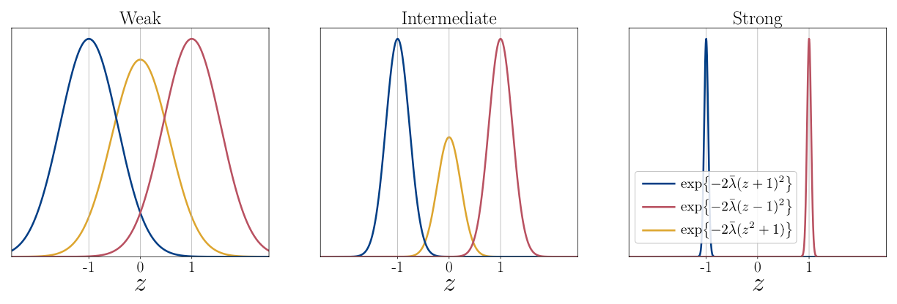

 

# Quantum feedback control

- [Quantum feedback control](#quantum-feedback-control)
  - [Gaussian measurement](#gaussian-measurement)
    - [Gaussian measurementの基礎](#gaussian-measurementの基礎)
    - [Gaussian measurementの連続測定に対するマスター方程式](#gaussian-measurementの連続測定に対するマスター方程式)
    - [SSE](#sse)
  - [continuous measuement-based feedback control](#continuous-measuement-based-feedback-control)

Gaussian measurementsの導入とWiseman-Milburn方程式の導出まで

参考文献

Annby-Andersson, B. (2024). Continuous measurements of small systems: Feedback control, thermodynamics, entanglement. Ph.D. thesis. Lund University.

## Gaussian measurement

### Gaussian measurementの基礎

離散観測結果$m$に対応するKraus演算子$K_m$の代わりに, 連続観測結果$z$に対応する$K_z$ (Gaussian measurement演算子) を導入.

$K(z)=(\frac{2\lambda dt}{\pi})^{1/4}e^{-\lambda dt (z-A)^2}$

ここで$A$はエルミートな観測量.

$\lambda$は観測の強度を表す. $\lambda\rightarrow\infty$のとき射影測定を表す (コヒーレンスは破壊, 不確定性小). $\lambda\rightarrow 0$のときweak measurement (システムに与える影響は小さい, コヒーレンス保存, 不確定性大).

→トレードオフ

測定ノイズがGaussian

2準位系の例 (黄色がコヒーレンス部分)

### Gaussian measurementの連続測定に対するマスター方程式

条件付き密度演算子

$\rho_c(t+dt)=e^{\mathcal{L}dt}\frac{K(z)\rho_c(t)K^\dag(z)}{p_c(z)}$

$\mathcal{L}$はシステムのダイナミクスを記述するリュウビル演算子 (測定に依存しない部分)

これを各軌跡に対して期待値をとると, 連続測定一般に成り立つマスター方程式が得られる.

$\partial_t\rho(t)=\mathcal{L}\rho(t)+\lambda \mathcal{D}[A]\rho(t)$

第一項は測定がないときの時間発展, 第2項は測定によるbackactionを表す.

$\mathcal{L}\rho=-i[H, \rho]$として, $L=\sqrt{\lambda}A$とするとチャネルが1つのときのLindbladに一致

SSEを考えるとdiffusion measurement (homodyne detection) に一致することもわかる.

### SSE

測定値$z$は以下のように書かれる.

$z=\langle A\rangle + \frac{1}{2\sqrt{\lambda}}\frac{dW}{dt}$

これを用いて条件付き密度演算子を$dt$のオーダで展開するとSSEが得られる.

$d\rho_c=dt\mathcal{L}\rho_c+\lambda dt \mathcal{D}[A]\rho_c+\sqrt{\lambda}dW\{A-\langle A\rangle, \rho_c\}$

$\mathcal{L}\rho_c$の部分は$-i[H, \rho_c]$と書かれることも多い. これはBelavkin (ベラフキン) 方程式と呼ばれる.

第一項はシステムの時間発展, 第2項は測定のbackaction, 第3項は測定によるノイズを表す.

## continuous measuement-based feedback control

Belavkin方程式をフィードバックを含むように拡張する.

システムのダイナミクスを測定結果依存にすればよいので$\mathcal{L}\rightarrow \mathcal{L[f(\boldsymbol{D})]}$と置き換えることになる.

ここで$\boldsymbol{D}$は測定結果の軌跡, $f(\cdot)$は測定結果に対する任意の関数 (feedback前に実行される).

取り扱いを単純にするためにMarkovian feedback (feedbackプロトコルが直前の測定結果$D$のみに依存) を考えるときは$f(\boldsymbol{D})\rightarrow D$とすればよい.

このとき測定結果$z$に比例したフィードバックを与える事を考える. つまり

$\mathcal{L}(z)=\mathcal{L}_0+z\mathcal{K}=\mathcal{L_0}+\langle A\rangle\mathcal{K}+\frac{1}{2\sqrt{\lambda}}\frac{dW}{dt}\mathcal{K}$

ここで$\mathcal{L}_0$はフィードバックがないときのシステムのダイナミクスを記述. $\mathcal{K}$はフィードバックを記述するLiouville superoperator.

$e^\mathcal{L}(z)dt\simeq 1+dt\mathcal{L}_0+\langle A\rangle dt \mathcal{K} + dt \mathcal{K}^2/8\lambda+dW\mathcal{K}/\sqrt{4\lambda}$を用いると ($E[dW^2]=dt$を用いた)

SSEは
$
d \hat{\rho}_c = dt \mathcal{L}_0 \hat{\rho}_c + \lambda dt \mathcal{D}[\hat{A}] \hat{\rho}_c + \frac{dt}{2} \mathcal{K}\{\hat{A}, \hat{\rho}_c\} + \frac{dt}{8 \lambda} \mathcal{K}^2 \hat{\rho}_c + dW \left[\sqrt{\lambda} \{\hat{A} - \langle \hat{A} \rangle_c, \hat{\rho}_c\} + \frac{1}{\sqrt{4 \lambda}} \mathcal{K} \hat{\rho}_c\right].
$

全てのトラジェクトリについて平均をとるとWiseman-Milburn方程式が得られる.
$
\partial_t \hat{\rho} = \mathcal{L}_0 \hat{\rho} + \lambda \mathcal{D}[\hat{A}] \hat{\rho} + \frac{1}{2} \mathcal{K}\{\hat{A}, \hat{\rho}\} + \frac{1}{8 \lambda} \mathcal{K}^2 \hat{\rho},
$

第1, 2項は連続測定のマスター方程式に由来. 第3項はfeedback forcesがどのように働くかを表す. 第4項はノイズ項 $dW$に由来していて, 測定ノイズがどのようにfeedbackされるかを表す. $\lambda$が大きくなると検出器のノイズが小さくなり, その効果は小さくなる.