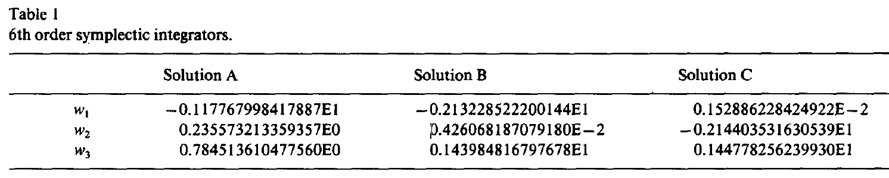
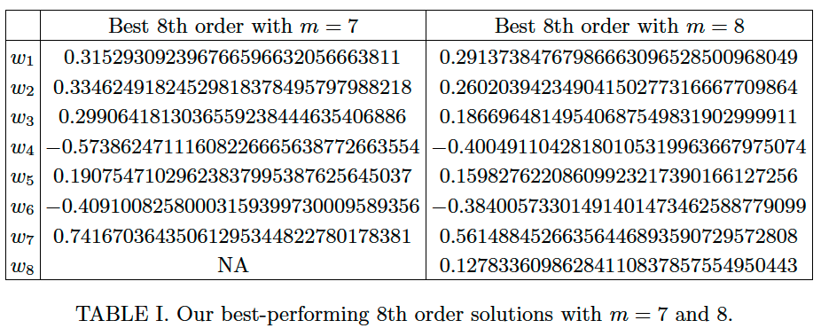

 

# 高次トロッター分解

- [高次トロッター分解](#高次トロッター分解)
  - [背景知識](#背景知識)
  - [Suzuki's fractal method](#suzukis-fractal-method)
  - [Yoshida's method](#yoshidas-method)
    - [Approach](#approach)
    - [背景知識 : Symmetric Baker-Campbell-Haussdorff公式](#背景知識--symmetric-baker-campbell-haussdorff公式)
    - [6次の積公式の場合](#6次の積公式の場合)
  - [Processed product formulae](#processed-product-formulae)
  - [Greatly improved higher-order product formulae for quantum simulation](#greatly-improved-higher-order-product-formulae-for-quantum-simulation)
    - [手法1](#手法1)
    - [手法2](#手法2)
    - [結果](#結果)
    - [性能評価手法の提案](#性能評価手法の提案)

## 背景知識
$H=A+B$

通常のトロッター分解 : $\exp((A+B)t)=\exp(At)\exp(Bt)+O(t^2)$

トロッター分解の一般化

1次の分解 : $\exp((A+B)t)=\exp(At)\exp(Bt)+O(t^2)$

2次の分解 : $\exp((A+B)t)=\exp(At/2)\exp(Bt)\exp(At/2)+O(t^3)$

(両辺を$t$の2次までテーラー展開して係数を比較することで簡単に示せる.)

2次の積公式を以下で定義

$S_2(t):=\exp(At/2)\exp(Bt)\exp(At/2)$

一般に$k$次の積公式$S_k(t)$が分かっているとすると

$\exp((A+B)t)=S_k(t)+O(t^{k+1})$ (ここで$S_k(t)=\Pi_{j=1}^l \exp(c_jAt)\exp(d_jBt)$)

長い時間のシミュレーションを行うとき, 短い時間に分割して繰り返す

→繰り返し回数は次数の増加に伴って減少

→高次積公式の探索($\{c_j, d_j\}$を見つけること)のモチベーション

## Suzuki's fractal method

**元論文**

- 「Fractal decomposition of exponential operators with applications to many-body theories and Monte Carlo simulations, M. Suzuki, Physics Letters A, 1990」
- 「General theory of fractal path integrals with applications to many‐body theories and statistical physics, M. Suzuki, Journal of Mathematical Physics, 1991」

任意の高次積公式の系統的な導出手法

論文内ではより一般的な形での定式化 (Theorem 1近辺, $r$=3のとき)

**$k(=2\kappa)$次積公式** : $S_{2\kappa}(t)=S_{2\kappa-2}(s_\kappa t)S_{2\kappa-2}((1-2s_\kappa)t)S_{2\kappa-2}(s_\kappa t)$

としたとき$s_\kappa=1/(2-2^{1/(2\kappa-1)})$(←これが高次積公式探索の解)

$S_2$を用いて偶数次に対して再帰的に定義

$S_{2m}(t)=S_{2m-1}(t)$

expの数 : $2(J-1)3^{\kappa-1}+1$ ($J$はハミルトニアン$H$の項の数)

**3次のときの簡単な証明**

(準備)

$S_2(t)=\exp((A+B)t+O(t^3))=\exp((A+B)t+R_2t^2+R_3t^3+\dots)$とする(誤差は指数の肩に載せられることを用いた).

$S_2(t)$と$S_2(-t)$は可換なので($e^Ae^B=e^{(A+B)}$を用いると)

$S_2(t)S_2(-t)=\exp((A+B)t+R_2t^2+R_3t^3\dots-(A+B)t+R_2t^2-R_3t^3\dots)=\exp(2(R_2t^2+R_4t^4))$

また$S_2(t)S_2(-t)=I$

よって$R_2=R_4=\dots=0$

(証明)

$S_4(t)=S_2(s_2t)S_2((1-2s_2)t)S_2(s_2t)=\dots=\exp((A+B)t+[2s^3+(1-2s)^3]R_3+O(t^5))$

$2s^3+(1-2s)^3=0$を解くと$s=1/(2-\sqrt[3]{2})$

デメリット : $s_\kappa, 1-2s_\kappa>1$→誤差大

**デメリットを改善した公式**

$k(=2\kappa)$次積公式 : $S_{2\kappa}(t)=S_{2\kappa-2}(u_\kappa t)^2S_{2\kappa-2}((1-4u_\kappa)t)S_{2\kappa-2}(u_\kappa t)^2$

としたとき$u_\kappa=1/(4-4^{1/(2\kappa-1)})$

expの数 : $2(J-1)5^{\kappa-1}+1$ 

## Yoshida's method

「Construction of higher order symplectic integrators, H. Yoshida, Physics Letters A, 1990」

- Suzukiの手法では指数の数が急激に増える→指数の数を抑える手法
- この手法では高次積公式のexplicitで解析的な形式がないため, 複雑な連立非線形多項式方程式を導出して解く必要がある

### Approach

$S^{(m)}(t)=(\Pi^m_{j=1}S_2(w_{m-j+1}t))S_2(w_0t)(\Pi_{j=1}^mS_2(w_jt))$

task : $S^{(m)}$が$k$次の積公式になるような$m$と$w_i$を見つける

expの数 : $(4m+2)(J-1)+1$ 

### 背景知識 : Symmetric Baker-Campbell-Haussdorff公式

$\|X\|+\|Y\|<\ln 2$, $t\in \mathbb{R}$, $S_2(t)=\exp(Z)$としたとき以下が成立

$Z=\sum^{\infty}_{l=1}\alpha_l t^l$

ここで

$\alpha_{2n}=0$ (証明は上述済)

$\alpha_1=X+Y$

$\alpha_3=\frac{1}{12}[Y, [Y, X]]-\frac{1}{24}[X, [X, Y]]$

$\alpha_5=\frac{7}{5760}[X, X, X, X, Y]-\frac{1}{720}[Y, Y, Y, Y, X]+\frac{1}{360}[X, Y, Y, Y, X]+\frac{1}{360}[Y, X, X, X, Y]-\frac{1}{480}[X, X, Y, Y, X]+\frac{1}{120}[Y, Y, X, X, Y]$

例 $[Y, Y, X, X, Y]\equiv[Y, [Y, [X, [X, Y]]]]$

### 6次の積公式の場合

BCH公式を用いて$m=1$を計算してみる

$$
\begin{aligned}
S_2(w_1 t) S_2(w_0 t) S_2(w_1 t) 
&= \exp \left\{ t w_1 \alpha_1 + t^3 w_1^3 \alpha_3 + t^5 w_1^5 \alpha_5 + \mathcal{O}(t^7) \right\} \exp \left\{ t w_0 \alpha_1 + t^3 w_0^3 \alpha_3 + t^5 w_0^5 \alpha_5 + \mathcal{O}(t^7) \right\} \exp \left\{ t w_1 \alpha_1 + t^3 w_1^3 \alpha_3 + t^5 w_1^5 \alpha_5 + \mathcal{O}(t^7) \right\}\\
\dots \\
&= \exp \left\{ t(2w_1 + w_0) \alpha_1 + t^3 (2w_1^3 + w_0^3) \alpha_3 + t^5 (2w_1^5 + w_0^5) \alpha_5 + t^5 \frac{1}{6}(w_0^2 w_1^3 - w_1^2 w_0^3 + w_1^4 w_0 - w_0^4 w_1 ) \beta_5 + \mathcal{O}(t^7) \right\}.
\end{aligned}
$$

ここで $\beta_5 = [\alpha_1, \alpha_1, \alpha_3]$

※この時点で($m=1$までの計算で)4次積公式は求められるが6次積公式は求められない

なぜか

これが6次積公式であるためには

$(2w_1 + w_0)=1, (2w_1^3 + w_0^3)=(2w_1^5 + w_0^5)=(w_0^2 w_1^3 - w_1^2 w_0^3 + w_1^4 w_0 - w_0^4 w_1 )=0$

である必要があるが, 変数$w_0, w_1$が2つ, 非線形方程式が4つなので一般に解を持たない

これが4次積公式であるためには

$(2w_1 + w_0)=1, (2w_1^3 + w_0^3)=0$

を満たす$w_0, w_1$を求めれば良い.

ちなみに$w_0=-\frac{2^{1/3}}{2-2^{1/3}}, w_0=\frac{1}{2-2^{1/3}}$であり, 4次積公式が求められたことになる.

6次積公式を求めるためには$m$をさらに増やす必要がある.

一般に$m$を大きくして($t^7$のオーダまで)計算すると以下のようになる(帰納法的に示される).

$S^{(m)}(t)=\exp\{tA_{1, m}\alpha_1+t^3A_{3, m}\alpha_3+t^5(A_{5, m}\alpha_5+B_{5, m}\beta_5))+O(t^7)\}$

ここで$A_{j, m}, B_{5, m}$は$w_i$の多項式であり, 6次積公式を求めるためには$A_{1, m}=1, A_{3, m}=0, A_{5, m}=0, B_{5, m}=0$を解くことで$w_i$を求めることになる. 方程式が4本あるため未知数が4個であればよい, つまり$m=3$まで計算したとしたときに解が求められる.

$w_0=1-2\sum_j w_j$(証明の過程で簡単に示される)を用いると計算が少し楽になる.

3つの解が発見されている(これ以上ないと言われている)

## Processed product formulae

参考文献が多すぎて追いきれていないが1996~2006あたりに開発された手法

symmetricではない

$P\Sigma P^{-1}$ ($\Sigma$: kernel, $P$: processor)

$P$と$P^{-1}$は, 時間発展によって積をとるとキャンセル→コストはkernel依存→kernelのexpの数はこれまでの手法より軽い

典型的には$\Sigma$は$k$より低次, $P$は$k$次

$\Sigma$のパラメータを見つけ, $P$は既に知られているものを用いるので, 解くべき非線形方程式の数が少ない

詳細は省略

## Greatly improved higher-order product formulae for quantum simulation

[Mauro E. S. Morales+, arXiv, 2024]

8, 10次の改善された積公式を見つけ, より正しく性能を比較する手法を導出

積公式を系統的に得るようなテクニカルな手法を編み出したというより, こうやったら計算をごり押せるというのを見つけて, 何千もの新しい解を見つけまくったという印象. そして性能を比較することで質の高い積公式を見つけたというもの.

yoshida's methodで8次のとき最小の$m$は7, 10次のときは15.

大きい$m$をとるほどエラーを減らせる

 ### 手法1

連立非線形方程式を解くためにMatlabのfsolve(Levenverg-Marquardtアルゴリズム)を用いるとより高速に解が得られる. 小さい値を取る解ほど性能が高い. 大きな値を解は捨てる.

### 手法2

テイラー展開を用いる手法. 正確な$\exp(t(X+Y))$と, $w_j$で置いた積公式$S^{(m)}(t, w_1, ..., w_m)$を適当な次数までテイラー展開し, 係数を比較した等式を解くことで解$w_j$を得る. (本当に今まで誰も思いつかなかったのか？) 

具体的には以下のようになる ($\mathcal{T}_k[\cdot]$は$t=0$の周りでk次までテイラー展開をする写像)

正確な$\exp(t(X+Y))$のテイラー展開
$$
\begin{aligned}
T_k[e^{t(X+Y)}] &= \sum_{p=0}^k \frac{t^p}{p!}(X+Y)^p \\
&= \sum_{p=0}^k \frac{t^p}{p!} \sum_{r_1,\dots,r_p=0}^1 X^{r_1}Y^{1-r_1}\dots X^{r_p}Y^{1-r_p}
\end{aligned}
$$

Yoshida'sは以下のように書ける.
$$
\begin{aligned}
S^{(m)}(t, w_1,\dots,w_m) &= e^{tw_m X/2}e^{tw_{m}Y}e^{t(w_m + w_{m-1})X/2}e^{t(w_{m-1})Y}e^{t(w_{m-1}+w_{m-2}) X/2} \dots e^{tw_0 Y}e^{t({w_1+w_0}) X/2}e^{tw_1 Y} \dots e^{tw_m X/2} \\
&=e^{tc_1X}e^{tc_2Y}\dots e^{tc_{4m+3}X}
\end{aligned}
$$
ここで$c_1=w_m/2, c_2=w_m, c_3=(w_m+w_{m-1})/2, \dots, c_{4m+3}=w_m/2$

これをテイラー展開すると以下のようになる.
$$
\begin{aligned}
T_k[S^{(m)}(t, w_1, \dots, w_m)] = \sum_{r_1, \dots, r_{4m+3}=0, r_1+\cdots+r_{4m+3}\leq k}^{4m+3} \frac{t^{r_1 + \dots + r_{4m+3}}}{r_1! \dots r_{4m+3}!} 
c_1^{r_1} \dots c_{4m+3}^{r_{4m+3}} X^{r_1} Y^{r_2} \dots X^{r_{k-1}}Y^{r_{4m+3}}
\end{aligned}
$$

係数を自動的に管理するためのデータ構造を構成

### 結果

8次

[S. Blanes+, Mathematics of Computation, 2013]などで用いられた性能比較 : エラー$\delta(t)$は$O(t^9)$なので$\delta(t)=\chi t^9$と書ける($\chi$は定数). random Hamiltonianに対して, $\chi$を計算する. エラーはスペクトラルノルム(得られた行列の差)や固有値の差を用いて計算.

$m=7$のときの8次の解は以下

ここで$\chi=5.8\times10^{-6}$. yoshidaの解で最も良かったもので$\chi=9.7\times10^{-4}$

$m=8$のときはunderdetermined(未知数よりも方程式の数が少ない)な方程式になる. 連続な解を持つため, 手法1(恐らく)を使えばエラーを減らせる

yoshida形式だけでなく, prosessed形式に対しても解を探索している.

10次に対しては今まで見つけられていなかった解を数多く発見

### 性能評価手法の提案

異なる次数, 異なるexpの数でも比較ができるような性能比較手法を提案

最適なオーダは$T/\epsilon$に依存(total evolution time/required error)

$T/\epsilon$が小さいときには低次積公式を用いるのがいい, 大きいときには高次にするべき.

その閾値を決定する方法を導出した

<!-- また$T/\epsilon$が$10^6$~$10^{14}$のとき(量子化学への応用を考えると典型的な値), 今回導出した8次積公式がベストであることを示した. -->

$k$次積公式を用いたとき, spectral-normエラーを用いたときの誤差は$\delta(t)=\chi t^{k+1}$, 固有値誤差の場合は$\delta(t)=\zeta t^{k+1}$であるとする. $\epsilon$を最大許容誤差とし, $t=T/r$によって各time stepの長さ(time interval)を定義する.

**same order, different lengthのとき**
$\chi (T/r)^{k+1}\simeq\epsilon/r$より$r\simeq(\chi T/\epsilon)^{1/k}T$

time intervalあたりのexpの数は$(4m+2)(J-1)+1$. つなぎ合わせると2つのexpは合体するので$(4m+2)(J-1)$. よって合計expの数は

$M(\frac{\chi T}{\epsilon})^{1/k}T$

に比例. ここで$M=2m+1$. つまり同じオーダの積公式を比較したいときは$M \chi^{1/k}$を比較すれば良く, 値が小さいほど効率が良い積公式である. 固有値誤差を見るときは$\chi$を$\zeta$にすればよい.

**異なる次数のとき**

2つの異なる次数$k_1$, $k_2$があるとする. それらに対応して$\chi_1$, $\chi_2$があるとする. 2つの積公式のexpの数が同じであるとすると

$M_1(\frac{\chi_1 T}{\epsilon})^{1/k_1}T=M_2(\frac{\chi_2 T}{\epsilon})^{1/k_2}T$

ここから

$\frac{T}{\epsilon}=(\frac{M_2\chi_2^{1/k_2}}{M_1\chi_1^{1/k_1}})^\frac{1}{\frac{1}{k_1}-\frac{1}{k_2}}$

この値が高次の側の積公式を用いた方が性能が高くなる閾値となる. 

ハミルトニアンは正規化されているという条件で考えていることに注意

time intervalが長いときはより一般的な方法を取る必要がある.

**measure of error**

- 量子化学など, ハミルトニアンの固有値を推定するのが目標の場合は固有値誤差. 
- 最終の状態ベクトルに興味がある場合はspectral-norm.←固有値と基底の誤差の両方を考慮したもの

基底誤差と固有値誤差の比は

$\frac{2\mu}{\zeta T}(\frac{\epsilon}{\zeta T})^{\nu k}$

で与えられる. つまり大きな$T$に対して固有値誤差が支配的になる. よってsingle stepに対する固有値誤差は, long-time evolutionに対するspectral-norm誤差を推定するのに適切なmeasureである.

結論

既存研究ではspectral-normエラーを用いられているが, 固有値エラーを用いたほうがよい. 
なぜなら、より長い時間発展における誤差を支配するのは、単一ステップにおける固有値誤差だから

<!-- $U$をexact, $\tilde{U}$を積公式によるユニタリ行列とする. $U$はハミルトニアンの基底で対角化でき, $\tilde{U}$は$\tilde{U}=VDV^\dagger$と対角化できるとする.

$D$と$U$の差は固有値誤差, $V$は基底誤差を記述する. -->

